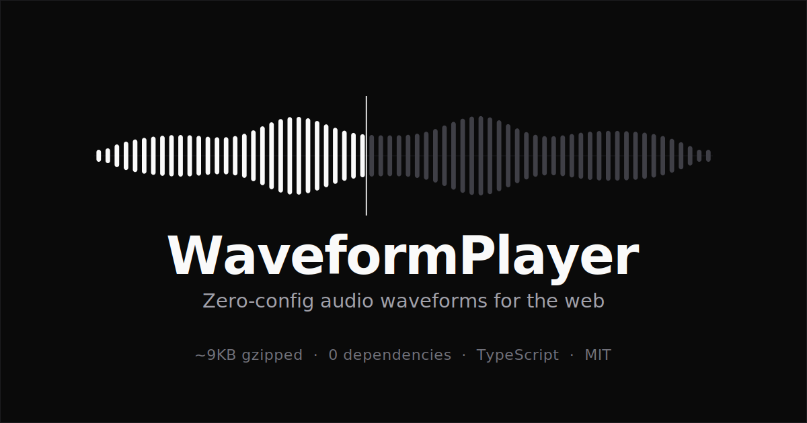

<div align="center">

# WaveformPlayer

**Zero-config audio waveforms for the web.**
Add a `data-` attribute to a `<div>` — get a real, interactive waveform player. No build step, no dependencies, ~10KB.

[](https://www.npmjs.com/package/@arraypress/waveform-player)
[](https://bundlephobia.com/package/@arraypress/waveform-player)
[](https://www.npmjs.com/package/@arraypress/waveform-player)
[](./index.d.ts)
[](./LICENSE)

[Live demo](https://waveformplayer.com) · [Docs](https://waveformplayer.com/#docs) · [npm](https://www.npmjs.com/package/@arraypress/waveform-player)



</div>

---

## Quick start

No build tools. No initialization. Drop in two files and add a `<div>`.

```html
<link rel="stylesheet" href="https://unpkg.com/@arraypress/waveform-player/dist/waveform-player.css">
<script src="https://unpkg.com/@arraypress/waveform-player/dist/waveform-player.min.js"></script>

<div data-waveform-player data-url="track.mp3" data-title="My Song"></div>
```

It auto-initializes every `[data-waveform-player]` on the page when the DOM is ready. That's it.

## Install

```bash
npm install @arraypress/waveform-player
```

```js
import WaveformPlayer from '@arraypress/waveform-player';
import '@arraypress/waveform-player/styles.css';

const player = new WaveformPlayer('#player', { url: 'track.mp3' });
```

Ships ESM + CommonJS + a standalone IIFE for `<script>` tags, with bundled TypeScript definitions.

## Why

|                     | WaveformPlayer | WaveSurfer.js | Amplitude.js |
| ------------------- | :------------: | :-----------: | :----------: |
| Size (gzipped)      |    **~10KB**     |     40KB+     |    35KB+     |
| Zero-config (HTML)  |       ✓        |       —       |      —       |
| Dependencies        |     None       |     None      |     None     |
| Real waveforms      |       ✓        |       ✓       |      —       |
| TypeScript types    |       ✓        |       ✓       |      —       |
| Keyboard + ARIA     |       ✓        |    partial    |      —       |
| Media Session API   |       ✓        |       —       |      —       |

## Features

- **Zero-config** — works from plain HTML via `data-` attributes; no JS required.
- **6 visual styles** — bars, mirror, line, blocks, dots, seekbar — plus rounded caps and gradient fills.
- **Real audio analysis** — decodes peaks with the Web Audio API, or uses pre-generated data.
- **Accessible** — the waveform is a keyboard-operable ARIA slider out of the box.
- **Framework-ready** — first-party [React](https://github.com/arraypress/waveform-player-react) and [Astro](https://github.com/arraypress/waveform-player-astro) wrappers; works anywhere otherwise.
- **Batteries included** — chapter markers, BPM detection, Media Session, speed control, auto theme detection.
- **Tiny** — ~10KB gzipped, zero dependencies, TypeScript types bundled.

## Visual styles

Set with `data-style` (or the longer `data-waveform-style`), or the `style` / `waveformStyle` option.

| Style     | Look                                |
| --------- | ----------------------------------- |
| `mirror`  | Symmetrical, SoundCloud-style (default) |
| `bars`    | Classic bottom-anchored bars        |
| `line`    | Smooth oscilloscope line            |
| `blocks`  | Segmented LED meter                 |
| `dots`    | Circular points                     |
| `seekbar` | Minimal progress bar, no peaks      |

**Modern caps & gradients** (bundle-neutral):

```js
new WaveformPlayer('#player', {
  url: 'track.mp3',
  waveformStyle: 'mirror',
  barRadius: 3,                              // rounded bar caps
  waveformColor: ['#fafafa', '#71717a'],     // vertical gradient (array of stops)
  progressColor: ['#ffffff', '#a1a1aa'],
});
```

In zero-config markup, pass a gradient as a JSON array: `data-waveform-color='["#fafafa","#71717a"]'`.

## Usage

### HTML (zero JavaScript)

```html
<div data-waveform-player
     data-url="track.mp3"
     data-title="My Song"
     data-subtitle="Artist Name"
     data-waveform-style="mirror"
     data-bar-radius="3"
     data-show-playback-speed="true"
     data-markers='[{"time": 30, "label": "Chorus"}]'>
</div>
```

### Waveform only (custom UI)

```html
<div data-waveform-player
     data-url="track.mp3"
     data-show-controls="false"
     data-show-info="false">
</div>
```

### JavaScript API

```js
import WaveformPlayer from '@arraypress/waveform-player';

const player = new WaveformPlayer('#player', {
  url: 'track.mp3',
  waveformStyle: 'mirror',
  height: 80,
  markers: [
    { time: 30, label: 'Verse',  color: '#4ade80' },
    { time: 60, label: 'Chorus', color: '#f59e0b' },
  ],
});
```

## Options

| Option               | Type                  | Default     | Description                                              |
| -------------------- | --------------------- | ----------- | ------------------------------------------------------- |
| `url`                | `string`              | `''`        | Audio file URL                                          |
| `waveformStyle`      | `string`              | `'mirror'`  | `bars` · `mirror` · `line` · `blocks` · `dots` · `seekbar` |
| `height`             | `number`              | `60`        | Waveform height (px)                                    |
| `barWidth`           | `number`              | style-based | Bar width (px)                                          |
| `barSpacing`         | `number`              | style-based | Gap between bars (px)                                   |
| `barRadius`          | `number`              | `0`         | Rounded bar-cap radius (px) — bars/mirror              |
| `waveformColor`      | `string \| string[]`  | preset      | Unplayed colour; array = vertical gradient            |
| `progressColor`      | `string \| string[]`  | preset      | Played colour; array = vertical gradient              |
| `colorPreset`        | `'dark' \| 'light' \| null` | `null` | Force a theme, or `null` to auto-detect               |
| `samples`            | `number`              | `200`       | Peak samples to extract                                 |
| `waveform`           | `number[] \| string`  | `null`      | Pre-generated peaks (array, `.json` URL, or JSON)      |
| `audioMode`          | `'self' \| 'external'`| `'self'`    | Own the `<audio>`, or delegate (see below)            |
| `markers`            | `WaveformMarker[]`    | `[]`        | Chapter markers                                        |
| `showControls`       | `boolean`             | `true`      | Show the play/pause button                             |
| `showInfo`           | `boolean`             | `true`      | Show title/subtitle/time                               |
| `showPlaybackSpeed`  | `boolean`             | `false`     | Show the speed menu                                    |
| `showBPM`            | `boolean`             | `false`     | Detect + display BPM                                   |
| `autoplay`           | `boolean`             | `false`     | Play on load                                           |
| `enableMediaSession` | `boolean`             | `true`      | System media controls (self mode)                     |
| `accessibleSeek`     | `boolean`             | `true`      | Expose the waveform as a keyboard ARIA slider         |
| `seekLabel`          | `string`              | `null`      | Accessible name for the slider (falls back to title)  |

Full option types ship in [`index.d.ts`](./index.d.ts).

## Accessibility

By default the waveform is a keyboard-operable [ARIA slider](https://www.w3.org/WAI/ARIA/apg/patterns/slider/): `.waveform-container` gets `role="slider"`, joins the tab order, and reports `aria-valuemin`/`max`/`now` plus a readable `aria-valuetext` (e.g. `"0:30 of 2:00"`). When focused:

| Key                                          | Action       |
| -------------------------------------------- | ------------ |
| <kbd>←</kbd> / <kbd>↓</kbd> · <kbd>→</kbd> / <kbd>↑</kbd> | Seek ∓5s |
| <kbd>Page Down</kbd> / <kbd>Page Up</kbd>    | Seek ∓10s    |
| <kbd>Home</kbd> / <kbd>End</kbd>             | Start / end  |

Works in both audio modes, respects `prefers-reduced-motion`, and announces load errors to screen readers. Opt out with `accessibleSeek: false`; localize with `seekLabel`.

## API

```js
player.play();                 // returns the <audio>.play() promise in self mode
player.pause();
player.togglePlay();

player.seekTo(30);             // seconds
player.seekToPercent(0.5);
player.setVolume(0.8);
player.setPlaybackRate(1.5);

await player.loadTrack('next.mp3', 'Title', 'Artist', { artwork: 'cover.jpg' });
player.destroy();              // removes all listeners + DOM

// Statics
WaveformPlayer.getInstance('id');
WaveformPlayer.getAllInstances();
WaveformPlayer.destroyAll();
const peaks = await WaveformPlayer.generateWaveformData('track.mp3');
const jsonUrl = WaveformPlayer.getPeaksUrl('track.mp3'); // -> 'track.json'
```

### Events

Lifecycle callbacks via options, or DOM events on the container (all bubble, `e.detail` is typed):

```js
new WaveformPlayer('#player', {
  url: 'track.mp3',
  onPlay:  (player) => {},
  onPause: (player) => {},
  onEnd:   (player) => {},
  onTimeUpdate: (currentTime, duration, player) => {},
});

el.addEventListener('waveformplayer:timeupdate', (e) => {
  const { currentTime, duration, progress } = e.detail;
});
```

## External audio mode

Set `audioMode: 'external'` and the player becomes a visualization-only surface: play/pause/seek dispatch cancelable events, and you drive the canvas back with `setPlayingState()` / `setProgress()`. This is how [`@arraypress/waveform-bar`](https://github.com/arraypress/waveform-bar) turns many inline players into one persistent bar.

```js
const player = new WaveformPlayer(el, { audioMode: 'external' });

el.addEventListener('waveformplayer:request-play', (e) => {
  audio.src = e.detail.url;        // e.detail = { url, title, subtitle, artist, artwork, id, player }
  audio.play();
});
audio.addEventListener('timeupdate', () => player.setProgress(audio.currentTime, audio.duration));
audio.addEventListener('play',  () => player.setPlayingState(true));
audio.addEventListener('pause', () => player.setPlayingState(false));
```

| Event                          | Detail                                              |
| ------------------------------ | --------------------------------------------------- |
| `waveformplayer:request-play`  | `{ url, title, subtitle, artist, artwork, id, player }` |
| `waveformplayer:request-pause` | Same shape                                          |
| `waveformplayer:request-seek`  | Same shape + `{ percent: 0..1 }`                    |

## Frameworks

| Environment | Package |
| ----------- | ------- |
| React       | [`@arraypress/waveform-player-react`](https://github.com/arraypress/waveform-player-react) |
| Astro       | [`@arraypress/waveform-player-astro`](https://github.com/arraypress/waveform-player-astro) |
| Vanilla / anything else | this package — `new WaveformPlayer(el, opts)` and `player.destroy()` on teardown |

## Ecosystem

- **[WaveformBar](https://github.com/arraypress/waveform-bar)** — persistent bottom-bar player with queue, favorites, and cross-page session.
- **[WaveformPlaylist](https://github.com/arraypress/waveform-playlist)** — zero-JS playlists and chapters.
- **[WaveformGen](https://github.com/arraypress/waveform-gen)** — pre-generate peak JSON at build time.
- **[WaveformTracker](https://github.com/arraypress/waveform-tracker)** — audio engagement analytics.

## Pre-generated waveforms

Skip client-side decoding by storing peaks next to each file (`track.mp3` ↔ `track.json`):

```js
new WaveformPlayer('#player', {
  url: track.audioUrl,
  waveform: WaveformPlayer.getPeaksUrl(track.audioUrl),
});
```

`getPeaksUrl()` swaps a known audio extension (`mp3`, `wav`, `ogg`, `flac`, `m4a`, `aac`) for `.json`, preserving query/hash, and returns `undefined` for anything else (so the player falls back to live decoding).

## Browser support

Chrome/Edge 90+, Firefox 88+, Safari 14+, and modern mobile browsers. Rounded bar caps use `roundRect` where available (Safari 16+) and fall back to square bars elsewhere.

## Development

```bash
npm install
npm run dev      # watch build
npm test         # vitest
npm run build    # all bundles
npm run size     # gzipped size
```

## License

MIT © [ArrayPress](https://github.com/arraypress) · created by [David Sherlock](https://github.com/arraypress)
